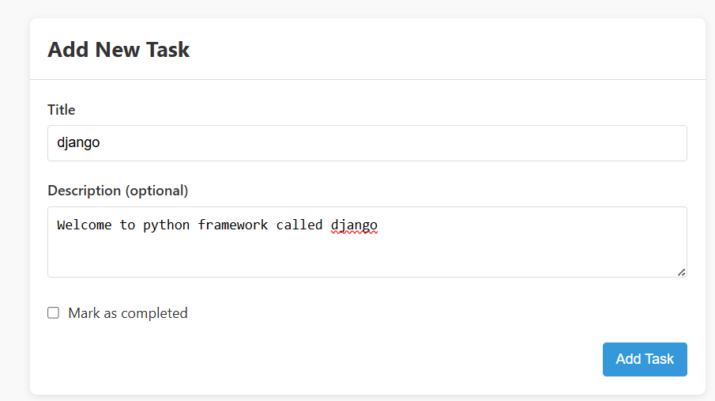

#Setting Up the project
Note: Just copy the scripts only co not include the quotes("")

  # starting the backend server
1.Open the Project Directory
2.open the terminal
3.cd backend
4.activate the virtual environment by "venv\Scripts\activate"
5.install all the necessary requirements for the server side by
"pip install -r requirements.txt"
6.python manage.py makemigrations
7.python manage.py migrate
8.python manage.py runserver

starting the frontend server
1.open another terminal minus closing the first terminal
2.navigate to frontend directory by "cd frontend"
3."npm install" //To install all react.js dependencies
4."npm start" //To start the frontend server

//NB: make sure both the servers are running

## Contratulations if your servers are running
and finally check in you browser.
Your Application should look like this

#when you add the task minus marking complete it will look like this

#when you add the task marked complete it will look like this

  
